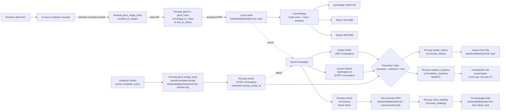

# AdSpark Studio

> **AI Campaign + Character Studio.** Type a business idea, get a
> Runway-powered cinematic ad. Generate a reusable brand
> mascot/founder/coach character, turn it into a Runway Avatar, and
> reuse that same identity across host clips, multilingual voiceover,
> and a live "Talk to your spokesperson" call — every artefact cached
> locally — in under five minutes.

A RunwayML hackathon entry. AdSpark Studio is no longer just an AI ad
generator. Phase K turns AdSpark into a **brand-character studio**:
the user generates a reusable **Character** (mascot, founder, coach,
or local guide) from a portrait template, binds that portrait to a
Runway Avatar, and attaches the character to any campaign. The same
character drives the campaign's **Avatar Host Clip**, its **Audio
Pack** (custom Brand Voice + 29-language dubs), and its optional
**Realtime Spokesperson session** over WebRTC. Every asset cached
locally so saved campaigns survive Runway's URL expiry.

- **Real Runway, end-to-end.** `gen4_image_turbo` synthesises the
  campaign reference image **and** the character portrait;
  `/v1/avatars` turns any portrait — campaign image or generated
  character — into a reusable spokesperson; `gen4.5` (text or image)
  or `gen4_turbo` (image-to-video) renders the campaign clip;
  `avatar_videos` records the character speaking; `/v1/voices`
  designs a custom Brand Voice; `/v1/voice_dubbing` produces
  29-language dubs; `/v1/realtime_sessions` powers a live conversation
  with the character avatar. Local ffmpeg burns title + CTA overlays
  into three platform-tuned MP4s and synthesises mock audio when keys
  are absent.
- **Reusable brand characters.** Characters live outside any single
  campaign. Generate a portrait once with one of four locked
  templates (mascot / founder / coach / local guide), bind it to a
  Runway Avatar, then attach the same character to every campaign in
  the gallery. The character's avatar wins the resolution chain
  (`character > selected > host`) so every downstream feature uses
  one consistent identity.
- **Mock-mode safe.** Without keys the same UI flow runs end-to-end
  with deterministic concepts, a stdlib mock reference PNG, an
  in-memory mock task that "succeeds" with a public sample MP4, a
  synthetic mock avatar, stdlib-PNG character portraits, ffmpeg-only
  host + voice + dub placeholders, and four hard-coded "preset"
  entries in the avatar picker. Realtime surfaces as a clearly
  disabled state. No third-party calls. Ideal for CI and pre-demo
  dry runs.
- **Credit-safe by design.** A model-aware backend policy validates
  every request and returns `400` *before* any outbound HTTP. Real
  Runway calls fire only on user click. The API key never reaches the
  browser — even the realtime WebRTC handshake is brokered through a
  one-shot `sessionKey` that the client never trades for the secret.
- **Browser smoke test** drives the full mock flow on every change
  with Playwright + Chromium.

📄 **Submission write-up:** [`SUBMISSION.md`](./SUBMISSION.md)
🎬 **Screen-recording script:** [`DEMO_SCRIPT.md`](./DEMO_SCRIPT.md)
🧭 **Next-session handoff:** [`00-START-NEXT-SESSION.md`](./00-START-NEXT-SESSION.md)
🔬 **Capability research:** [`docs/research/RUNWAY_API_CAPABILITY_MAP.md`](./docs/research/RUNWAY_API_CAPABILITY_MAP.md)

## Submission tags

Five tags coexist on origin so any version is reproducible:

| Tag | Commit | Story |
|---|---|---|
| `hackathon-submission` | `7ed949e` | Pre-avatar baseline. Concept → Image → Video → Campaign Pack. |
| `hackathon-submission-v2` | `e6ca02b` | Adds Brand Spokesperson Avatar + Avatar Host Clip. |
| `hackathon-submission-v3` | `515701f` | Adds Brand Voice + 29-language Multilingual Dubs. |
| `hackathon-submission-v4` | `89918c3` | Adds Realtime Brand Spokesperson + Avatar Picker. |
| **`hackathon-submission-v5`** | **`0cddb96`** | **Canonical full submission.** Adds Character Studio V1 — reusable brand characters with generated portraits, Runway Avatar binding, and per-campaign attachment. |

`git checkout hackathon-submission-v5` and follow the quickstart below
gets you the entire feature stack including Character Studio.

## Architecture at a glance



Every step left of `Cache` can run in mock mode without a key. The
Pack is fully local. Character Studio's portrait + avatar steps both
have deterministic mock paths (stdlib PNG + synthetic READY avatar
reusing the portrait as the thumbnail). Spokesperson + Audio Pack
mock paths produce deterministic placeholders. Realtime is the only
feature that requires a real Runway key — its mock path renders a
clearly disabled button with explanatory copy.

## TL;DR — run it locally

```bash
# Terminal 1 — backend (uvicorn on :8000)
cd backend && python -m venv .venv && source .venv/bin/activate
pip install -r requirements.txt
uvicorn app.main:app --reload --port 8000

# Terminal 2 — frontend (Vite on :5173, /api + /health proxied to :8000)
cd frontend && npm install && npm run dev
```

Open `http://localhost:5173`. With no `RUNWAY_API_KEY` set, you're in
mock mode and can drive the full flow except the realtime handshake.
Drop a real key into the **repo-root** `.env` to unlock everything.

## Required + optional env vars

The repo-root `.env` (gitignored) is the single source of secrets.
Copy `backend/.env.example` to the repo root and fill what you need:

```env
# REQUIRED for real Runway image + video + avatar + voice + realtime
RUNWAY_API_KEY=rwk_...

# OPTIONAL — defaults sufficient for the hackathon build
RUNWAY_API_BASE=https://api.dev.runwayml.com
RUNWAY_API_VERSION=2024-11-06
RUNWAY_MODEL=gen4_turbo
RUNWAY_HOST_VOICE_PRESET=vincent
RUNWAY_HOST_PORTRAIT_URL=https://images.unsplash.com/photo-1507003211169-0a1dd7228f2d?w=512&q=80

# OPTIONAL — leave blank to keep concepts mocked (deterministic and demo-safe)
OPENAI_API_KEY=sk-...
OPENAI_MODEL=gpt-4o-mini

# OPTIONAL — defaults already match dev
ALLOWED_ORIGINS=http://localhost:5173
DATA_DIR=./data
```

### Mock mode (no keys, no spend)

With both keys blank or missing:

| Surface | Behaviour |
|---|---|
| `/api/concepts` | Deterministic mock concepts derived from the form |
| `/api/runway/image` | Stdlib zlib PNG written locally |
| `/api/runway/generate` | In-memory mock task, "succeeds" in ~12 s with a public sample MP4 |
| `/api/campaigns/{id}/avatar` | Synthetic READY avatar with stdlib PNG thumbnail |
| `/api/campaigns/{id}/host-video` | ffmpeg lavfi 5 s 720×720 silent placeholder MP4 |
| `/api/campaigns/{id}/brand-voice` | ffmpeg lavfi 3 s silent MP3 placeholder |
| `/api/campaigns/{id}/dub` | ffmpeg lavfi 3 s silent MP3 placeholder per language |
| `/api/runway/avatars` | 4 hard-coded preset entries (Music Superstar, Cat Character, Fashion Designer, Cooking Teacher) with stdlib data-URI thumbnails |
| `/api/characters/{id}/generate-portrait` | Deterministic stdlib zlib PNG cached at `backend/data/characters/<id>-portrait.png` |
| `/api/characters/{id}/create-avatar` | Synthetic READY avatar id; cached portrait reused as the thumbnail data URI |
| `/api/campaigns/{id}/attach-character` | Same path as real — character lookups are local, no Runway call required |
| `/api/campaigns/{id}/spokesperson-session` | HTTP 503 with explanatory copy; UI shows a clearly disabled button |

To force mock mode without editing `.env`, override the keys at shell
launch time:

```bash
RUNWAY_API_KEY= OPENAI_API_KEY= uvicorn app.main:app --port 8000
```

Empty-string env vars override `.env` values via pydantic-settings.

## Demo flow (≈4–5 minutes live)

1. **Mode banner check.** Confirms backend health and which providers
   are real. Readiness chip should read `demo ready · concepts mocked`
   (typical) or `demo ready · all live`.
2. **Generate concepts.** Form → 3 ad concepts with one flagged
   `recommended` and an editable Runway prompt.
3. **Pick a concept.** Selecting another card swaps the prompt; the
   text remains editable.
4. **Generate Reference Image** (Runway `gen4_image_turbo`).
5. **Generate Video** (Runway `gen4.5` text-or-image, or `gen4_turbo`
   image-to-video).
6. **Save campaign card.** Backend downloads the presigned Runway MP4
   to `backend/data/videos/<id>.mp4`.
7. **Build Campaign Pack.** Three buttons: Landscape (1280×720),
   Reels (720×1280), Square (960×960).
8. **Open the Character Studio panel** *(Phase K — above the
   gallery)*. Click **+ Create Character**, pick a template (mascot
   / founder / coach / local guide), and submit. The portrait
   auto-generates via `gen4_image_turbo` (~14 s real / instant mock).
9. **Click Create Runway Avatar** on the new character card. Runway
   binds the portrait into a reusable avatar (~30–45 s).
10. **Click Use Character** under any saved campaign's Brand
    Spokesperson section. The character avatar becomes the active
    spokesperson for that campaign.
11. **Or, Choose Existing Runway Avatar** — pick from any of your
    account's existing avatars in the picker grid (skipped when a
    character is attached).
12. **Or, Create Custom Brand Spokesperson** — fall back to per-
    campaign avatar creation when you don't want a reusable
    character.
13. **Present Campaign** — record an Avatar Host Clip via
    `avatar_videos`. The character avatar wins the resolution chain.
14. **Design Brand Voice** — `/v1/voices` text-design produces a
    custom voice; preview MP3 caches locally.
15. **Dub** — produce per-language dubs of the Brand Voice preview.
16. **Talk to Brand Spokesperson** — open a 5-minute live WebRTC
    conversation with the active avatar. Mic-only V1.

The exact clicks for a screen recording live in
[`DEMO_SCRIPT.md`](./DEMO_SCRIPT.md) (six paths: mock, live, fallback,
host clip, picker+realtime, **character studio full demo**).

## Generation settings

The prompt panel exposes:

- **Model** — Gen-4 Turbo (image-to-video) or Gen-4.5 (text or image).
- **Source ratio** — Landscape 1280:720, Reels 720:1280, Square 960:960.
- **Duration** — 5 / 8 / 10 s. Locked at 5 s when Gen-4 Turbo is
  selected.
- **Use text-only video** — checkbox enabled only for Gen-4.5.

Backend enforces the same per-model policy and returns a clear `400`
on any unsupported combination. The frontend persists every choice in
`localStorage` under `adspark.settings.v1`.

## Saved campaigns cache videos locally

Runway returns presigned CloudFront URLs that expire after about a
week. The backend caches every saved video at
`backend/data/videos/<campaign_id>.mp4` (gitignored, 100 MB cap,
content-type-checked). The gallery prefers the cached URL over the
presigned Runway URL.

## Campaign Pack — local ffmpeg finishing

Once a campaign has a cached video, three Build buttons run a local
ffmpeg pass each — no extra provider call:

| Format | Dimensions | Filename | Use |
|---|---|---|---|
| Landscape | 1280×720 | `<id>-finished.mp4` (legacy filename) | YouTube, web |
| Reels | 720×1280 | `<id>-finished-reels.mp4` | TikTok, Reels, Shorts |
| Square | 960×960 | `<id>-finished-square.mp4` | Instagram feed |

Filter chain: `scale=W:H:force_original_aspect_ratio=increase,crop=W:H,
drawtext=<title>,drawtext=<cta>` plus `libx264` / `veryfast` / CRF 23 /
`+faststart` and `-c:a copy`.

Requires `ffmpeg` on `PATH`. macOS: `brew install ffmpeg`.

## Character Studio — reusable brand characters

Phase K turned the existing Runway primitives (`gen4_image_turbo` +
`/v1/avatars`) into a first-class **Character** resource that lives
outside any single campaign. The Character Studio panel sits above
the saved-campaigns gallery.

1. **Create Character** — pick one of four locked templates (`mascot`,
   `founder`, `coach`, `local_guide`), provide a name + voice preset,
   optionally describe the subject / style / personality. Portrait
   generation auto-runs — `gen4_image_turbo` synthesises a
   1280×720 portrait sized for `/v1/avatars` and caches it at
   `backend/data/characters/<id>-portrait.png`.
2. **Create Runway Avatar** (`POST /api/characters/{id}/create-avatar`) —
   reads the cached portrait, embeds as data URI (≤5 MB), POSTs to
   `/v1/avatars`, polls READY (~30–45 s). The character gains a
   `runway_avatar_id` + processed thumbnail URL.
3. **Attach to a campaign** (`POST /api/campaigns/{id}/attach-character`,
   `{character_id}` in body — `null` to detach). Character avatars
   automatically appear in the existing Avatar Picker via `GET /v1/avatars`.

Once attached, the campaign's Brand Spokesperson section shows the
attached character (pink-bordered card) and hides the Avatar Picker
+ Create Custom flows. **The character's avatar wins the resolution
chain** so the Avatar Host Clip, Audio Pack delivery, and Realtime
Spokesperson all use one consistent identity:

```
character.runway_avatar_id  >  selected_avatar_id  >  host_avatar_id
```

The 30 universal voice presets accepted by `/v1/avatars` are exposed
in the create form (default `vincent`). Local delete cleans the
portrait + JSON entry but **does not** call Runway DELETE; the
account-side avatar persists for reuse from the Avatar Picker.

> **Why this matters commercially.** A business that runs through
> AdSpark doesn't just leave with one ad. It leaves with a reusable
> brand mascot or founder spokesperson it can keep using across every
> campaign, host clip, and live conversation that follows. Characters
> are durable IP — they outlive any single campaign.

## Brand Spokesperson + Avatar Host Clip + Avatar Picker

Every saved campaign exposes a two-step path that turns it into a
reusable Runway Avatar narrator, plus a picker that lets you reuse
any avatar your account has already created:

1. **Choose Existing Runway Avatar** — `GET /api/runway/avatars`
   proxies Runway's avatar list (or returns 4 hard-coded mock presets
   in mock mode). Click an avatar card → `POST /select-avatar`
   persists it on the campaign. Selection wins over the per-campaign
   custom avatar for both Host Clip and realtime.
2. **Create Brand Spokesperson** (`POST /avatar`) — alternative to
   the picker when you want a fresh per-campaign avatar.
   Reference-image source falls back: explicit override → campaign's
   `reference_image_url` → configured stock portrait. The "Retry with
   stock portrait" button explicitly forces the stock fallback when
   Runway rejects the campaign image (e.g., no face).
3. **Present Campaign** (`POST /host-video`) — records an Avatar Host
   Clip via `/v1/avatar_videos` using the selected (or custom)
   avatar. Output cached at `backend/data/host/<id>.mp4`.

The avatar identity (`host_avatar_id`, voice preset, processed
thumbnail) is persisted on the campaign so subsequent host-clip and
realtime requests skip avatar creation.

> **About Runway's preset characters:** the docs mention slug-style
> preset names like `music-superstar`, `cat-character`,
> `fashion-designer`, `cooking-teacher`. As of this build, **those are
> not API-accessible** — `/v1/avatar_videos` validates `avatar.avatarId`
> as a UUID and rejects slugs with `Invalid UUID`, and there is no
> separate preset-listing endpoint. The picker shows them as mock
> entries so the UX stays demoable; if Runway exposes presets via
> `GET /v1/avatars` later, the picker surfaces them automatically.

## Audio Pack — Brand Voice + Multilingual Dubs

Every saved campaign exposes a two-step audio path:

1. **Design Brand Voice** (`POST /brand-voice`) — `POST /v1/voices`
   text-design produces a custom voice from a templated description
   (`{tone} mid-range American spokesperson voice for {business},
   speaking to {audience}…`). Polls to READY (~10 s). Preview MP3
   downloads to `backend/data/audio/<id>-voice-preview.mp3`.
2. **Dub** (`POST /dub` with `target_lang`) — `POST
   /v1/voice_dubbing` re-voices the cached preview into one of 29
   ISO 639-1 languages (`en, hi, pt, zh, es, fr, de, ja, ar, ru, ko,
   id, it, nl, tr, pl, sv, fil, ms, ro, uk, el, cs, da, fi, bg, hr,
   sk, ta`). Output MP3 cached at
   `backend/data/audio/<id>-dub-<lang>.mp3`.

Direct text-to-speech narration of an arbitrary script is **deferred**
— Runway's `/v1/text_to_speech` endpoint requires a `voice.type`
discriminator that's gated and not unlocked via probing. The Brand
Voice preview MP3 + dub pipeline gives full multilingual voice
delivery despite this. See
[`docs/research/RUNWAY_API_CAPABILITY_MAP.md`](./docs/research/RUNWAY_API_CAPABILITY_MAP.md)
Appendix C for the schema findings.

## Talk to Brand Spokesperson — Realtime WebRTC

Once an avatar is selected (picker) or created (custom), every saved
campaign card unlocks a **Talk to Brand Spokesperson** subsection. One
click opens a live 5-minute WebRTC call where you speak (mic) and the
avatar responds in their configured voice.

```
Browser              FastAPI broker          Runway
 │                       │                     │
 │ POST /spokesperson-session ─────────────────►
 │                       │  POST /v1/realtime_sessions
 │                       │  ├ poll GET to READY
 │                       │  └ pulls sessionKey out of READY payload
 │ ◄───────── { session_id, session_key, expires_at, avatar_id }
 │
 │ <AvatarCall sessionKey={…} audio video=false> ─► Runway media
 │                                                  WebRTC handshake
```

- **Mic-only V1.** `<AvatarCall audio video={false}>` — no webcam.
- **5-minute session cap** (Runway-imposed `expiresAt`). Frontend
  countdown surfaces it.
- **API key never leaves FastAPI.** The browser only ever sees the
  short-lived `sessionKey` JWT.
- **Lazy-loaded SDK.** `@runwayml/avatars-react` is split into a
  separate chunk — initial bundle stays at ~190 KB JS / ~58 KB gzip.
- **Mock mode** returns HTTP 503; UI renders a disabled button with
  explanatory copy. No WebRTC plumbing in CI.

## Browser smoke test (Playwright)

A single Chromium-driven end-to-end test exercises the full mock flow
on every change: ModeBanner pills, readiness chip, model + ratio +
duration selectors with documented defaults, settings persistence
after reload, mock concept generation, mock video generation reaching
`SUCCEEDED`, campaign save, gallery rendering with `video ready` +
`cached locally`, Campaign Pack three Build buttons, Brand
Spokesperson + Runway Avatar labels + Create button, Audio Pack +
Runway Voices + Design Brand Voice button, Avatar Picker grid +
Music Superstar mock entry, and the disabled Realtime "Start
Conversation (unavailable)" button.

```bash
# Terminal 1 — backend in fully mocked mode
cd backend && source .venv/bin/activate
RUNWAY_API_KEY= OPENAI_API_KEY= uvicorn app.main:app --port 8000

# Terminal 2 — Vite on :5173
cd frontend && npm run dev

# Terminal 3 — the test
cd frontend && npm run test:e2e
```

The test is **single-shot, single-worker, Chromium-only**, and never
opens a WebRTC connection. Don't run it against a backend with real
keys in the shell environment — the assertions specifically expect
mock pills.

Test artifacts (`frontend/test-results/`,
`frontend/playwright-report/`, `frontend/.playwright/`) are gitignored.

## Endpoints

32 application routes plus 4 FastAPI built-ins (`/openapi.json`,
`/docs`, `/docs/oauth2-redirect`, `/redoc`) for **36 routes total**.

| Method | Path | Purpose |
|---|---|---|
| `GET`  | `/health` | Liveness + per-provider mock flags |
| `GET`  | `/api/runway/provider-status` | Secret-free policy metadata |
| `GET`  | `/api/runway/organization` | Defensive proxy of `/v1/organization`; non-blocking |
| `GET`  | `/api/runway/avatars` | List account avatars (real — incl. character avatars) or 4 mock presets |
| `POST` | `/api/concepts` | `{business, product, tone, audience}` → 3 concepts + recommended Runway prompt |
| `POST` | `/api/runway/image` | `{prompt_text, ratio}` → cached PNG via `gen4_image_turbo` |
| `GET`  | `/api/runway/image/{image_id}` | Stream the cached PNG |
| `POST` | `/api/runway/generate` | `{prompt_text, prompt_image?, model, ratio, duration}` → `{task_id, status, model, endpoint}` |
| `GET`  | `/api/runway/task/{task_id}` | Poll status; ≥5 s + jitter, capped at 5 min |
| `POST` | `/api/campaigns` | Save a campaign card; downloads + caches the MP4 |
| `GET`  | `/api/campaigns` | List saved campaigns |
| `GET`  | `/api/campaigns/{id}/video` | Stream the cached MP4 |
| `POST` | `/api/campaigns/{id}/finish?format=...` | Build a Campaign Pack format with local ffmpeg |
| `GET`  | `/api/campaigns/{id}/finished-video` | Legacy: serves the landscape finished MP4 |
| `GET`  | `/api/campaigns/{id}/finished-video/{fmt}` | Per-format finished MP4 |
| `POST` | `/api/campaigns/{id}/avatar` | Phase 1 — create the per-campaign Brand Spokesperson Runway Avatar |
| `POST` | `/api/campaigns/{id}/select-avatar` | Pick an existing Runway avatar (picker) |
| `POST` | `/api/campaigns/{id}/attach-character` | **Phase K** — attach a Character to the campaign (`null` detaches) |
| `POST` | `/api/campaigns/{id}/host-video` | Phase 2 — record the Avatar Host Clip (uses character > selected > host avatar) |
| `GET`  | `/api/campaigns/{id}/host-video` | Stream the cached host clip MP4 |
| `POST` | `/api/campaigns/{id}/brand-voice` | Audio Phase 1 — design Brand Voice via `/v1/voices` |
| `POST` | `/api/campaigns/{id}/dub` | Audio Phase 2 — multilingual dub via `/v1/voice_dubbing` |
| `GET`  | `/api/campaigns/{id}/audio/{kind}` | Stream cached voice-preview or per-language dub MP3 |
| `POST` | `/api/campaigns/{id}/spokesperson-session` | Realtime broker — returns client-safe `{session_id, session_key, expires_at, avatar_id}` |
| `DELETE` | `/api/campaigns/{id}/spokesperson-session/{session_id}` | End-conversation cleanup |
| `GET`  | `/api/characters` | **Phase K** — list saved characters |
| `POST` | `/api/characters` | **Phase K** — create a Character record (no Runway calls) |
| `GET`  | `/api/characters/{id}` | **Phase K** — fetch a single Character |
| `POST` | `/api/characters/{id}/generate-portrait` | **Phase K** — `gen4_image_turbo` portrait via locked template prompt |
| `POST` | `/api/characters/{id}/create-avatar` | **Phase K** — bind the cached portrait to a Runway Avatar (`POST /v1/avatars`) |
| `GET`  | `/api/characters/{id}/portrait` | **Phase K** — stream the cached portrait PNG |
| `DELETE` | `/api/characters/{id}` | **Phase K** — local delete (does not call Runway DELETE) |

## Project layout

```
backend/
  app/
    main.py                         FastAPI app + CORS + /health + routers
    config.py                       pydantic-settings (env-driven mock flags)
    models.py                       Pydantic schemas (campaign + character + request/response)
    services/
      concept_service.py            OpenAI + deterministic mock fallback
      image_client.py               Runway text_to_image (real + stdlib mock PNG)
      runway_client.py              Generation policy + image_to_video / text_to_video routing
      finisher_service.py           Local ffmpeg Campaign Pack
      character_host_client.py      Runway Avatars + avatar_videos two-phase host
                                    (active_avatar_id resolves character > selected > host)
      avatar_listing_client.py      Runway avatar list curation + 4 mock presets
      realtime_avatar_client.py     /v1/realtime_sessions broker (PR I)
      audio_client.py               Runway voices + voice_dubbing two-phase audio (PR H)
      character_studio_client.py    PR K — locked-template portrait + /v1/avatars binding
      character_store.py            PR K — JSON store for Character records (threading.Lock)
      storage.py                    JSON campaign store + atomic local caches
    routers/
      concepts.py runway.py campaigns.py characters.py (PR K)
  requirements.txt
  .env.example
  data/                             gitignored — see "cache layout" below

frontend/
  vite.config.js                    /api + /health proxy → :8000
  package.json                      includes @runwayml/avatars-react ^0.15.0
  src/
    App.jsx                         Orchestrates form → concepts → prompt → image → runway → save
                                    + mounts <CharacterStudio> above the gallery (PR K)
    api.js                          fetch wrapper (typed, JSON) incl. character helpers
    settings.js                     localStorage persistence with safety clamps
    errors.js                       Friendly error parser + per-call hints
    components/
      CampaignForm.jsx ConceptCards.jsx PromptPreview.jsx
      RunwayPanel.jsx CampaignGallery.jsx ModeBanner.jsx
      AvatarPicker.jsx              Pick existing Runway avatar (PR I+)
      RealtimeSpokesperson.jsx      Lazy-loaded <AvatarCall> wrapper (PR I)
      CharacterStudio.jsx           PR K — top-level studio panel (create + library grid)
      CharacterCard.jsx             PR K — character tile (used in studio + attach picker)

docs/
  WHAT_IT_IS.md                     concept + stack
  INVENTORY.md                      what's real / mocked / incomplete
  research/
    RUNWAY_API_CAPABILITY_MAP.md    Phase H/I findings + product roadmap
    RUNWAY_CHARACTER_HOST_SPIKE.md  PR F avatar schema probe
    RUNWAY_REALTIME_SPOKESPERSON_SPIKE.md  PR I realtime schema probe
    CHARACTER_STUDIO_SPIKE.md       PR K research / locked V1 design
  handoffs/SESSION_*.md             one per session (008/009 cover Character Studio)

DEMO_SCRIPT.md                      six-path screen-recording script (A/B/C/D/E + F = Character Studio)
SUBMISSION.md                       judge-facing summary
00-START-NEXT-SESSION.md            latest branch + priorities for the next session
```

### Local cache layout (everything under `backend/data/` is gitignored)

```
backend/data/
  campaigns.json                    Saved-campaign records (single-process JSON store)
  characters.json                   Saved-character records (PR K — single-process JSON store)
  images/                           gen4_image_turbo reference images
  videos/                           Cached Runway campaign MP4s
  finished/                         Campaign Pack outputs (Landscape / Reels / Square)
  host/                             Avatar Host Clip MP4s
  audio/                            Brand Voice previews + per-language dubs
  characters/                       PR K — character portrait PNGs (<id>-portrait.png)
```

## Generated media — never committed

Generated PNGs, downloaded Runway MP4s, finished Campaign Pack
outputs, host clips, voice previews, per-language dubs, and character
portraits all live under
`backend/data/{images,videos,finished,host,audio,characters}`. The
entire `data/` directory is gitignored via `backend/.gitignore`.
Verify before any commit:

```bash
git status --short                                # nothing under data/
git ls-files | grep -E '\.(env|mp4|png|wav|mp3)$' || echo ok
git check-ignore backend/data/host/foo.mp4        # should match
```

API keys live only in the repo-root `.env` (also gitignored). The
React app has no key access at runtime — every Runway call goes
through FastAPI. Local `/api/runway/image/<id>` URLs are converted to
base64 data URIs server-side before being posted to Runway, so
generated reference images can drive both video and avatar tasks
without needing public hosting.

## Safety / hygiene

- API keys never leave the backend; the React app talks only to
  FastAPI. Realtime is no exception — the browser only ever sees the
  short-lived `sessionKey`, never the Runway API secret.
- CORS is locked to `http://localhost:5173` by default.
- `.env` and `backend/data/` are gitignored.
- Real Runway calls require an explicit user click. The app never
  auto-generates on page load. The optional `/v1/organization`
  read-only metadata fetch is the sole exception and is non-blocking.
- A model-aware policy returns `400` on any unsupported model / ratio
  / duration / missing-image combination *before* any outbound HTTP.
- Polling is capped (60 attempts × 5 s + jitter ≈ 5 min) and stops
  immediately on terminal status.
- The realtime session is hard-capped at 5 minutes by Runway's
  `expiresAt`; the frontend countdown surfaces it.
- This repo is **not connected to `unified-donkey-betz`**. That project
  was inspected read-only for prompt-shape inspiration; nothing was
  copied verbatim and no edits were made there.
