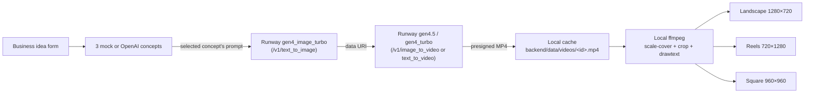

# AdSpark Studio

> **Type a business idea, get a Runway-powered cinematic ad — concept,
> reference image, video, and ready-to-post copy — in under three minutes.**

A RunwayML hackathon entry. AdSpark Studio walks the user from a one-line
business description to a full Campaign Pack: a 16:9 landscape spot, a
9:16 Reels/TikTok cut, and a 1:1 square — every asset cached locally so a
saved campaign keeps working long after Runway's presigned URLs expire.

- **Real Runway, end-to-end.** `gen4_image_turbo` synthesizes the
  reference image; `gen4.5` (text or image) or `gen4_turbo`
  (image-to-video) renders the clip; local ffmpeg burns title + CTA
  overlays into three platform-tuned MP4s.
- **Mock-mode safe.** Without keys the same flow runs end-to-end with
  deterministic concepts and an in-memory mock task that returns a
  public sample MP4 in ~12 s. No third-party calls. Ideal for CI and
  pre-demo dry runs.
- **Credit-safe by design.** A model-aware backend policy validates
  every request and returns clear `400`s before any outbound HTTP. Real
  Runway calls fire only on user click.
- **Browser smoke test** drives the full mock flow on every change with
  Playwright + Chromium.

📄 **Submission write-up:** [`SUBMISSION.md`](./SUBMISSION.md)
🎬 **Screen-recording script:** [`DEMO_SCRIPT.md`](./DEMO_SCRIPT.md)
🧭 **Next-session handoff:** [`00-START-NEXT-SESSION.md`](./00-START-NEXT-SESSION.md)

## Architecture at a glance



Every step left of `Pack` can run in mock mode without a key. Everything
right of `Cache` is fully local — no extra Runway calls per format.

## TL;DR — run it locally

```bash
# Terminal 1 — backend (uvicorn on :8000)
cd backend && python -m venv .venv && source .venv/bin/activate
pip install -r requirements.txt
uvicorn app.main:app --reload --port 8000

# Terminal 2 — frontend (Vite on :5173, /api + /health proxied to :8000)
cd frontend && npm install && npm run dev
```

Open `http://localhost:5173`. With **no** `RUNWAY_API_KEY` set, you're in
mock mode and can drive the full flow immediately. Drop a real key into
the **repo-root** `.env` to flip Runway into real mode.

## Required + optional env vars

The repo-root `.env` (gitignored) is the single source of secrets. The
backend reads it at startup via `pydantic-settings`. Copy
`backend/.env.example` to the repo root and fill what you need:

```env
# REQUIRED for real Runway image + video generation
RUNWAY_API_KEY=rwk_...

# OPTIONAL — defaults sufficient for the hackathon build
RUNWAY_API_BASE=https://api.dev.runwayml.com
RUNWAY_API_VERSION=2024-11-06
RUNWAY_MODEL=gen4_turbo                # default video model when one isn't chosen in the UI

# OPTIONAL — leave blank to keep concepts mocked (deterministic and demo-safe)
OPENAI_API_KEY=sk-...
OPENAI_MODEL=gpt-4o-mini

# OPTIONAL — defaults already match dev
ALLOWED_ORIGINS=http://localhost:5173
DATA_DIR=./data
```

### Mock mode (no keys, no spend)

With both keys blank or missing:

- `/api/concepts` returns deterministic mock concepts derived from the form.
- `/api/runway/image` writes a small, deterministic local PNG (no provider call).
- `/api/runway/generate` returns a `mock_<id>` task that "succeeds" in ~12 s
  with a public sample MP4.
- The MOCK MODE pill + Mode banner show real/mock state per provider and
  a top-level readiness chip ("demo mode" / "demo ready · concepts mocked"
  / "demo ready · all live").

To force mock mode without editing `.env`, override the keys at shell
launch time:

```bash
RUNWAY_API_KEY= OPENAI_API_KEY= uvicorn app.main:app --port 8000
```

Empty-string env vars override `.env` values via pydantic-settings.

## Demo flow (≈3 minutes)

1. **Mode banner check.** Confirms backend health and which providers
   are real.
2. **Generate concepts.** Form → 3 ad concepts with one flagged
   `recommended` and an editable Runway prompt.
3. **Pick a concept.** Selecting another card swaps the prompt; the
   text remains editable.
4. **Generate Reference Image** (Runway `gen4_image_turbo`).
   Synthesizes a 16:9 / 9:16 / 1:1 PNG matching the chosen Source ratio
   and caches it under `backend/data/images/<id>.png`. Click is
   required — no auto-generation.
5. **Generate Video** (Runway `gen4.5` text-or-image, or `gen4_turbo`
   image-to-video). Polled status with progress bar. Inline `<video>`
   preview when `SUCCEEDED`.
6. **Save campaign card.** Backend downloads the presigned Runway MP4 to
   `backend/data/videos/<id>.mp4` so the saved card keeps working
   forever.
7. **Build Campaign Pack.** Three buttons in the saved card: Landscape
   (1280×720), Reels (720×1280), Square (960×960). Each runs a single
   local ffmpeg pass — `scale=W:H:force_original_aspect_ratio=increase,
   crop=W:H` to cover-fit + center-crop without distortion, then
   `drawtext` overlays for title + CTA.

The exact clicks for a 60–90 s screen recording live in
[`DEMO_SCRIPT.md`](./DEMO_SCRIPT.md).

## Generation settings

The prompt panel exposes:

- **Model** — Gen-4 Turbo (image-to-video) or Gen-4.5 (text or image).
- **Source ratio** — Landscape 1280:720, Reels 720:1280, Square 960:960.
  Match the source ratio to your target Campaign Pack format to reduce
  cropping.
- **Duration** — 5 / 8 / 10 s. Locked at 5 s when Gen-4 Turbo is
  selected (single supported value at this scope).
- **Use text-only video** — checkbox enabled only for Gen-4.5; routes
  the request to `/v1/text_to_video` and skips the reference image.

Backend enforces the same per-model policy and returns a clear `400` on
any unsupported combination. The frontend persists every choice in
`localStorage` under `adspark.settings.v1` so a reload during the demo
preserves the configuration.

## Saved campaigns cache videos locally

Runway returns presigned CloudFront URLs that expire after about a week.
To make saved campaigns durable, the backend caches every saved video as
soon as `POST /api/campaigns` runs:

- File path: `backend/data/videos/<campaign_id>.mp4` (gitignored).
- Stable serve route: `GET /api/campaigns/{id}/video`.
- Campaign records carry `cached_video_url`, `cache_status` (`ok | failed
  | skipped`), and `cache_error`.
- Frontend gallery prefers the cached URL over the presigned Runway URL
  and shows a status badge: `cached locally` (green) / `cache failed`
  (rose) / `external URL may expire` (zinc).
- Failures are non-fatal. Cap is 100 MB per asset; downloads must report
  `content-type: video/*`.

## Campaign Pack — local ffmpeg finishing

Once a campaign has a cached video, the gallery's Campaign Pack section
shows three Build buttons. Each click runs a local ffmpeg pass — no extra
provider call:

| Format | Dimensions | Filename | Use |
|---|---|---|---|
| Landscape | 1280×720 | `<id>-finished.mp4` (legacy filename) | YouTube, web |
| Reels | 720×1280 | `<id>-finished-reels.mp4` | TikTok, Reels, Shorts |
| Square | 960×960 | `<id>-finished-square.mp4` | Instagram feed |

The ffmpeg filter chain:
```
scale=W:H:force_original_aspect_ratio=increase,crop=W:H,
drawtext=<title>,drawtext=<cta>
```
plus `libx264` / `veryfast` / CRF 23 / `+faststart` and `-c:a copy`.

Per-format URLs land in `Campaign.finished_videos[fmt]`; the legacy
`finished_video_url` field continues to mirror the landscape result for
back-compat with pre-PR-B saves.

Requires `ffmpeg` on `PATH`. macOS: `brew install ffmpeg`. The pipeline
is fully local — no provider keys, no network calls.

## Browser smoke test (Playwright)

A single Chromium-driven end-to-end test exercises the full mock flow on
every change: ModeBanner pills, readiness chip, model + ratio + duration
selectors with documented defaults, settings persistence after reload,
mock concept generation, mock video generation reaching `SUCCEEDED`,
campaign save, gallery rendering with `video ready` + `cached locally`,
and the three Campaign Pack Build buttons (when cache succeeded).

```bash
# Terminal 1 — backend in fully mocked mode (does NOT touch the repo-root
# .env; the empty shell vars take precedence over the .env file values)
cd backend && source .venv/bin/activate
RUNWAY_API_KEY= OPENAI_API_KEY= uvicorn app.main:app --port 8000

# Terminal 2 — Vite on :5173
cd frontend && npm run dev

# Terminal 3 — the test
cd frontend && npm run test:e2e
```

The test is **single-shot, single-worker** and never hits the real
Runway or OpenAI APIs. Don't run it against a backend with real keys in
the shell environment — the assertions specifically expect mock pills.

Test artifacts (`frontend/test-results/`, `frontend/playwright-report/`,
`frontend/.playwright/`) are gitignored.

## Endpoints

| Method | Path | Purpose |
|---|---|---|
| `GET`  | `/health` | Liveness + per-provider mock flags |
| `GET`  | `/api/runway/provider-status` | Secret-free policy metadata (models, ratios, durations, image-required) |
| `GET`  | `/api/runway/organization` | Defensive proxy of `/v1/organization`. Returns `{mock_mode, credits, monthly_credit_cap}`; failure is non-blocking |
| `POST` | `/api/concepts` | `{business, product, tone, audience}` → 3 concepts + recommended Runway prompt |
| `POST` | `/api/runway/image` | `{prompt_text, ratio}` → `{image_id, image_url}`. Real path uses `gen4_image_turbo` with a seeded reference (Runway requires ≥1) |
| `GET`  | `/api/runway/image/{image_id}` | Streams the cached PNG |
| `POST` | `/api/runway/generate` | `{prompt_text, prompt_image?, model, ratio, duration}` → `{task_id, status, model, endpoint}`. Routes to `image_to_video` or `text_to_video` |
| `GET`  | `/api/runway/task/{task_id}` | Poll status; client uses ≥5 s + jitter, capped at 60 attempts (~5 min) |
| `POST` | `/api/campaigns` | Save a campaign card; downloads + caches the MP4 to `backend/data/videos/<id>.mp4` |
| `GET`  | `/api/campaigns` | List saved campaigns |
| `GET`  | `/api/campaigns/{id}/video` | Stream the cached MP4 |
| `POST` | `/api/campaigns/{id}/finish?format=...` | Build a Campaign Pack format with local ffmpeg |
| `GET`  | `/api/campaigns/{id}/finished-video` | Legacy: serves the landscape finished MP4 |
| `GET`  | `/api/campaigns/{id}/finished-video/{fmt}` | Per-format finished MP4 |

## Project layout

```
backend/
  app/
    main.py              FastAPI app + CORS + /health + routers
    config.py            pydantic-settings (env-driven mock flags)
    models.py            Pydantic schemas
    services/
      concept_service.py   OpenAI + deterministic mock fallback
      image_client.py      Runway text_to_image (real + stdlib mock PNG)
      runway_client.py     Generation policy + image_to_video / text_to_video routing
      finisher_service.py  Local ffmpeg Campaign Pack
      storage.py           JSON campaign store + local video cache
    routers/
      concepts.py runway.py campaigns.py
  requirements.txt
  .env.example

frontend/
  vite.config.js         /api + /health proxy → :8000
  src/
    App.jsx              Orchestrates form → concepts → prompt → image → runway → save
    api.js               fetch wrapper (typed, JSON)
    settings.js          localStorage persistence with safety clamps
    errors.js            Friendly error parser + per-call hints
    components/          CampaignForm, ConceptCards, PromptPreview,
                         RunwayPanel, CampaignGallery, ModeBanner

docs/
  WHAT_IT_IS.md          concept + stack
  INVENTORY.md           what's real / mocked / incomplete
  handoffs/SESSION_*.md  one per session

DEMO_SCRIPT.md           60–90 s screen-recording script
SUBMISSION.md            judge-facing summary
00-START-NEXT-SESSION.md latest branch + priorities for the next session
```

## Generated media — never committed

Generated PNGs, downloaded Runway MP4s, and finished Campaign Pack
outputs all live under `backend/data/{images,videos,finished}`. The
entire `data/` directory is gitignored via `backend/.gitignore`. Verify
before any commit:

```bash
git status --short                                # nothing under data/
git ls-files | grep -E '\.(env|mp4|png|wav|mp3)$' || echo ok
git check-ignore backend/data/images/foo.png      # should match
```

API keys live only in the repo-root `.env` (also gitignored). The React
app has no key access at runtime — every Runway call goes through
FastAPI.

## Safety / hygiene

- API keys never leave the backend; the React app talks only to FastAPI.
- CORS is locked to `http://localhost:5173` by default.
- `.env` and `backend/data/` are gitignored.
- Real Runway calls require an explicit user click. The app never
  auto-generates on page load.
- A model-aware policy returns `400` on any unsupported model / ratio /
  duration / missing-image combination *before* any outbound HTTP, so
  misconfigured requests never burn credits.
- Polling is capped (60 attempts × 5 s + jitter ≈ 5 min) and stops
  immediately on terminal status.
- This repo is **not connected to `unified-donkey-betz`**. That project
  was inspected read-only for prompt-shape inspiration; nothing was
  copied verbatim and no edits were made there.
